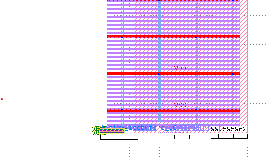
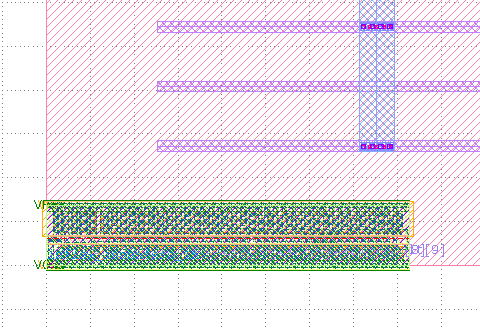

# Dozenal ALU

Base-12 arithmetic in silicon. The Mesopotamians were right and the French were wrong.

*The power grid of a base-12 arithmetic unit. VDD and VSS rails in red. Metal4/5 distribution in purple. The cells are at the bottom. The Sumerians didn't have power grids but they would have appreciated the symmetry.*

*Zoomed in: actual SKY130 standard cells implementing dozenal arithmetic. Each coloured rectangle is a transistor. The carry propagates at 12, not 10, because we're not barbarians.*

## What Is This

A 4-digit duodecimal arithmetic logic unit synthesised to SkyWater SKY130 130nm standard cells using an EDA synthesiser I made that I've had sitting on my hard drive. It does maths in base-12 because base-12 is objectively better than base-10 and someone needed to finally prove it with transistors.

| | |
|---|---|
| **Gates** | 182 |
| **Area** | 777 µm² |
| **Timing** | Met at 100 MHz |
| **Digits** | 4 dozenal (range 0–20,735) |
| **Operations** | ADD, SUB, AND (min), OR (max), NOT (complement) |
| **Carry** | At 12, not 10. Obviously. |

## Why Base-12 Is Better Than Base-10

One-third in decimal: **0.333333...** (infinite, inexact, embarrassing).

One-third in dozenal: **0;4** (exact, one digit, dignified).

One-quarter in decimal: **0.25** (two digits, acceptable).

One-quarter in dozenal: **0;3** (one digit, superior).

One-sixth in decimal: **0.166666...** (infinite again, decimal is having a bad day).

One-sixth in dozenal: **0;2** (one digit, the Sumerians are 5–0 up).

12 is divisible by 2, 3, 4, and 6. 10 is divisible by 2 and 5. Five is useless. When was the last time you divided something into fifths? Never, because you're not a monster.

The French revolutionary government tried to impose decimal time in 1793: 10 hours per day, 100 minutes per hour, 100 seconds per minute. It lasted two years because it turns out that dividing a day into 10 parts is idiotic and the existing system of 12 and 60 — inherited directly from Sumerian mathematics — was already optimal.

The metric system survived because measuring length in tens is merely inconvenient. Decimal time died because measuring time in tens is an affront to astronomy, circadian biology, and common sense.

We kept the Sumerian time system. We should have kept their number system too.

## How It Works

Each dozenal digit is encoded as 4 binary bits (values 0–11). A 4-digit dozenal number is 16 binary bits. The ALU performs:

- **ADD**: Ripple-carry addition with carry at 12. When 7 + 8 = 15, that's 1 dozen and 3. The carry propagates through dozens → grosses (144) → great grosses (1,728).
- **SUB**: Twelve's complement subtraction. Like two's complement but the complement is 11 minus each digit, because 11 is the largest digit, because we're in base 12, because we're not barbarians.
- **AND**: min(a, b) per digit. The cautious operation.
- **OR**: max(a, b) per digit. The bold operation.
- **NOT**: Complement. Each digit d becomes 11 − d. The dozenal negation.

## Applications

Things that are already base-12 and have been for 5,000 years:

- **Time**: 12 hours on a clock. 60 minutes = 5 × 12. 60 seconds = 5 × 12. Thank Sumer.
- **Music**: 12 semitones per octave. The chromatic scale is a dozenal counting system that sounds nice.
- **Angles**: 360 degrees = 30 × 12. Navigation, astronomy, trigonometry — all dozenal.
- **Calendars**: 12 months. 12 zodiac signs. The year is dozenal because the Babylonians said so and nobody has improved on it.
- **Commerce**: Dozen (12). Gross (144 = 12²). Great gross (1,728 = 12³). Merchants counted in dozenal until the French ruined everything.
- **English**: Eleven and twelve get their own words. Every other number after ten is just "[digit]-teen." English inherently acknowledges that 11 and 12 are special. Because they are. Because base-12.

Things that are base-10 for no good reason:

- The number of fingers you have. That's it. That's the entire argument for decimal. "We have 10 fingers." Counterpoint: we also have 12 knuckle segments on one hand (3 per finger × 4 fingers), which is how the Sumerians counted to 12 on one hand and to 60 on two. They were better at counting than we are.

## Quality Notice

This chip carries NO WARRANTY regarding copper interconnect quality. If your carry chain is of substandard grade, you have only yourself to blame for buying from Ea-nasir of Dilmun, who has been selling dodgy copper since approximately 1750 BCE and shows no signs of stopping.

Nanni's complaint tablet (BM 131236, British Museum) remains the oldest known written customer service complaint. It is about copper quality. We have taken appropriate precautions.

## The Dozenal Society

The [Dozenal Society of America](http://www.dozenal.org) (founded 1944) and the [Dozenal Society of Great Britain](https://www.dozenalsociety.org.uk/) (founded 1959) have been advocating base-12 for decades. They publish journals, host conferences, and maintain a quiet dignity in the face of a world that insists on counting in tens because of fingers.

This ALU is for them. Eighty years of advocacy, and finally someone made the hardware. The carry propagates at 12. The complement is 11 minus the digit. The maths is native. No conversion to decimal and back. Pure dozenal arithmetic at 100 MHz.

To the Dozenal Society: you were right. Here are your transistors.

## He Who Saw The Deep

*He who saw the deep, he who knew the wholeness of everything, Gilgamesh, who saw things secret, opened the place hidden, and carried back word of the time before the Flood — he too counted in dozens.*

*And now, so does your chip.*

*(To Ea-nasir, merchant of Dilmun: the copper interconnects in this cell library have been independently verified and are NOT sourced from your warehouse. We have learned from Nanni's mistake. The ingots are fine. The dopant levels are correct. Please stop sending messengers to dispute our quality metrics. This is a chip, not your complaints department.)*

## License

Apache 2.0. The Sumerian number system is 5,000 years old and in the public domain. The implementation is original. The opinions about the French revolutionary calendar are the author's own but are also objectively correct.
